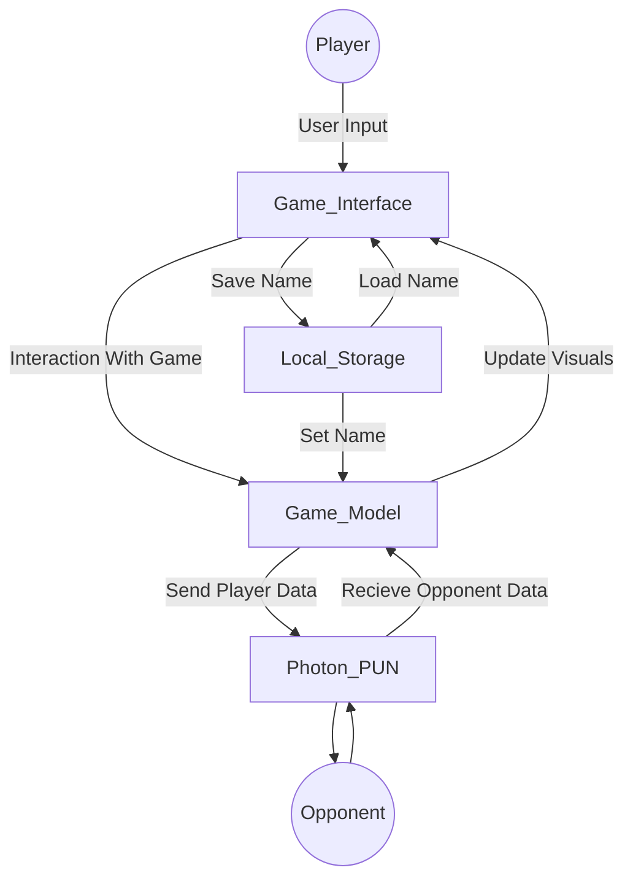
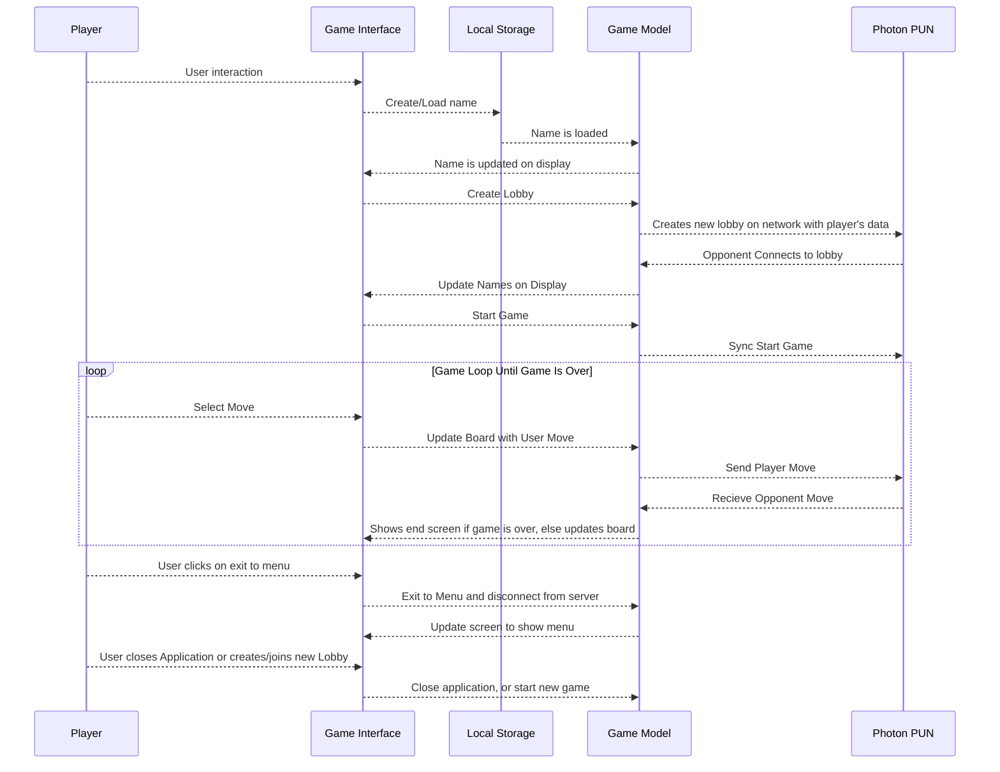

# 2 Design Overview

## 2.1 Description of Problem

The problem is creating a way to play American checkers over the internet with automatic rules enforcement. 

## 2.2 Technologies Used

This checkers game will use Unity3D as the core engine for rendering models and taking in user input. We will be utilizing Photon's PUN unity asset in order to handle the networking for the game.

The target platform will be Microsoft Windows and Linux, and the development environment will be Visual Studio Code and IntelliJ.

## 2.3 System Architecture

This system will be constructed from the following components:
* Photon PUN - A networking cloud service that integrates with the Unity engine through a marketplace asset and is used to handle data synchronization between clients. 
* Game Interface - The UI that the player will interact with to play checkers.
* Game Model - All of the classes related to creating our checkers game, such as the Board, Piece, Player, etc. All of the game data during a checkers game is stored in-memory inside of the game model and updated/synchronized using Photon PUN.
* Local Storage - Storage for data across sessions, like names. 

*Figure 1* above shows the connections between our high-level components.

## 2.4 System Operation

*Figure 2* shows the sequence of events that occur during a normal game of checkers.

