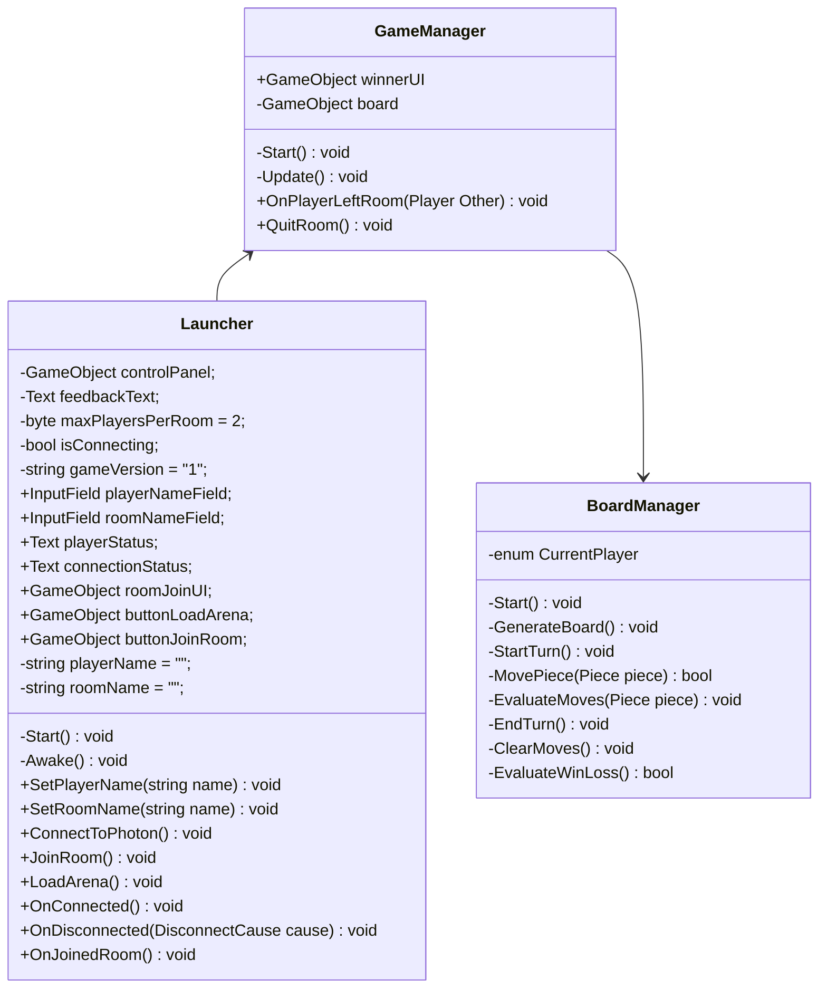

# 3 Networking Design Overview

The figure below shows the UML diagram of our networking interface.

Referenced this for network structure: https://www.raywenderlich.com/1142814-introduction-to-multiplayer-games-with-unity-and-photon