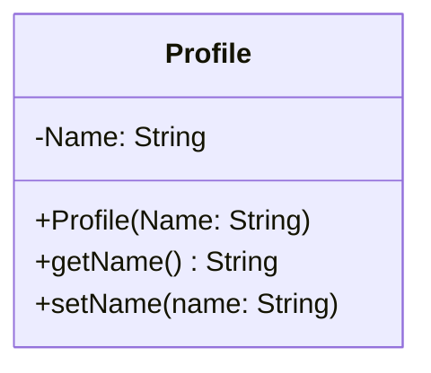
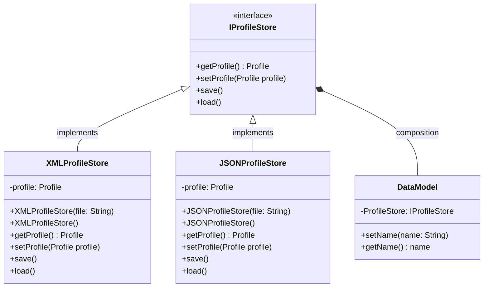

# 5 Data Model and Storage

### Data Model

The figure below depicts the UML for the Profile data model.

The figure below depicts the UML for the data storage.

### 5.1 DataModel

`DataModel` provides a facade for the data storage library.

#### 5.1.1 Attributes

| Name         | Type          | Description                          |
|--------------|---------------|--------------------------------------|
| ProfileStore | IProfileStore | Used to access the player's profile. |

#### 5.1.2 Methods

| setName(name: String) |                                                    |
|-----------------------|----------------------------------------------------|
| Input                 | The player's new username.                         |
| Output                | Void                                               |
| Description           | Modifies the user's current username and saves it. |

| getName(): String |                                          |
|-------------------|------------------------------------------|
| Input             | Void                                     |
| Output            | The player's current username.           |
| Description       | Retrieves the player's current username. |

### 5.2 IProfileStore

`IProfileStore` is an interface that provides resources for accessing the
user's profile.

#### 5.2.1 Methods

| getProfile(): Profile |                                                     |
|-----------------------|-----------------------------------------------------|
| Input                 | Void                                                |
| Output                | The player's current profile.                       |
| Description           | Retrieves the player's current profile from memory. |

| setProfile(profile: Profile) |                                                  |
|------------------------------|--------------------------------------------------|
| Input                        | The player's new profile.                        |
| Output                       | Void                                             |
| Description                  | Modifies the player's current profile in memory. |

| save()      |                                                            |
|-------------|------------------------------------------------------------|
| Input       | Void                                                       |
| Output      | Void                                                       |
| Description | Saves the state of the player's current profile in memory. |

| load()      |                                                              |
|-------------|--------------------------------------------------------------|
| Input       | Void                                                         |
| Output      | Void                                                         |
| Description | Loads the state of the player's current profile into memory. |

### 5.3 XMLProfileStore

`XMLProfileStore` is an implementation of `IProfileStore` that stores the
player's profile in an XML file.

#### 5.3.1 Attributes

| Name    | Type    | Description                                         |
|---------|---------|-----------------------------------------------------|
| Profile | Profile | An in-memory state of the player's current profile. |

#### 5.3.2 Methods

| getProfile(): Profile |                                                     |
|-----------------------|-----------------------------------------------------|
| Input                 | Void                                                |
| Output                | The player's current profile.                       |
| Description           | Retrieves the player's current profile from memory. |

| setProfile(profile: Profile) |                                                  |
|------------------------------|--------------------------------------------------|
| Input                        | The player's new profile.                        |
| Output                       | Void                                             |
| Description                  | Modifies the player's current profile in memory. |

| save()      |                                                                 |
|-------------|-----------------------------------------------------------------|
| Input       | Void                                                            |
| Output      | Void                                                            |
| Description | Saves the state of the player's current profile to an XML file. |

| load()      |                                                                               |
|-------------|-------------------------------------------------------------------------------|
| Input       | Void                                                                          |
| Output      | Void                                                                          |
| Description | Loads the state of the player's current profile into memory from an XML file. |

### 5.4 JSONProfileStore

`JSONProfileStore` is an implementation of `IProfileStore` that stores the
player's profile in a JSON file.

#### 5.4.1 Attributes

| Name    | Type    | Description                                         |
|---------|---------|-----------------------------------------------------|
| Profile | Profile | An in-memory state of the player's current profile. |

#### 5.4.2 Methods

| getProfile(): Profile |                                                     |
|-----------------------|-----------------------------------------------------|
| Input                 | Void                                                |
| Output                | The player's current profile.                       |
| Description           | Retrieves the player's current profile from memory. |

| setProfile(profile: Profile) |                                                  |
|------------------------------|--------------------------------------------------|
| Input                        | The player's new profile.                        |
| Output                       | Void                                             |
| Description                  | Modifies the player's current profile in memory. |

| save()      |                                                                 |
|-------------|-----------------------------------------------------------------|
| Input       | Void                                                            |
| Output      | Void                                                            |
| Description | Saves the state of the player's current profile to a JSON file. |

| load()      |                                                                               |
|-------------|-------------------------------------------------------------------------------|
| Input       | Void                                                                          |
| Output      | Void                                                                          |
| Description | Loads the state of the player's current profile into memory from a JSON file. |

