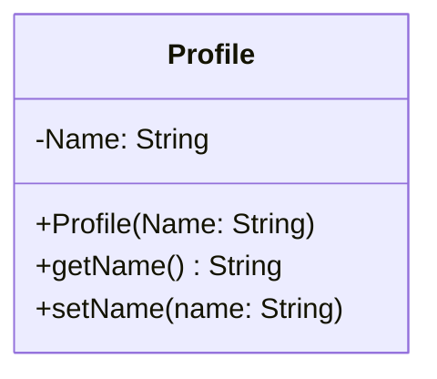
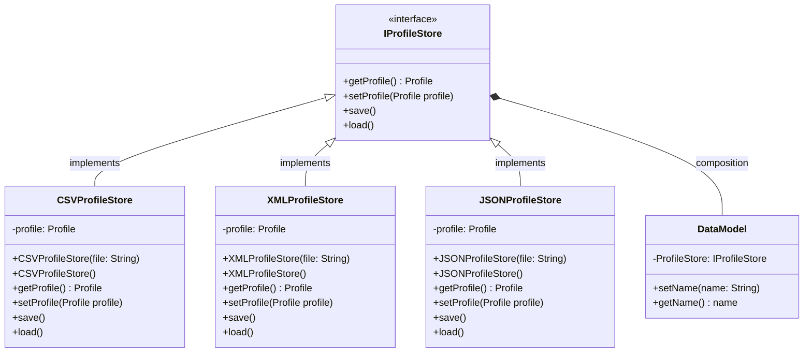

# 5 Data Model and Storage

### Data Model

The figure below depicts the UML for the Profile data model.

```mermaid
classDiagram
    class Profile {
          -Name: String
          +Profile(Name: String)
          +getName() String
          +setName(name: String)
    }
```

The figure below depicts the UML for the data storage.

```mermaid
classDiagram
    IProfileStore <|-- CSVProfileStore: implements
    IProfileStore <|-- XMLProfileStore: implements
    IProfileStore <|-- JSONProfileStore: implements
    IProfileStore *-- DataModel: composition

    class DataModel {
        -ProfileStore: IProfileStore
        +setName(name: String)
        +getName() name
    }

    class IProfileStore {
        +getProfile() Profile
        +setProfile(Profile profile)
        +save()
        +load()
    }
    <<interface>> IProfileStore

    class CSVProfileStore { 
        -profile: Profile
        +CSVProfileStore(file: String)
        +CSVProfileStore()
        +getProfile() Profile
        +setProfile(Profile profile)
        +save()
        +load()
    }

    class XMLProfileStore {
        -profile: Profile
        +XMLProfileStore(file: String)
        +XMLProfileStore()
        +getProfile() Profile
        +setProfile(Profile profile)
        +save()
        +load()   
    }

    class JSONProfileStore {
        -profile: Profile
        +JSONProfileStore(file: String)
        +JSONProfileStore()
        +getProfile() Profile
        +setProfile(Profile profile)
        +save()
        +load()   
    }
```
