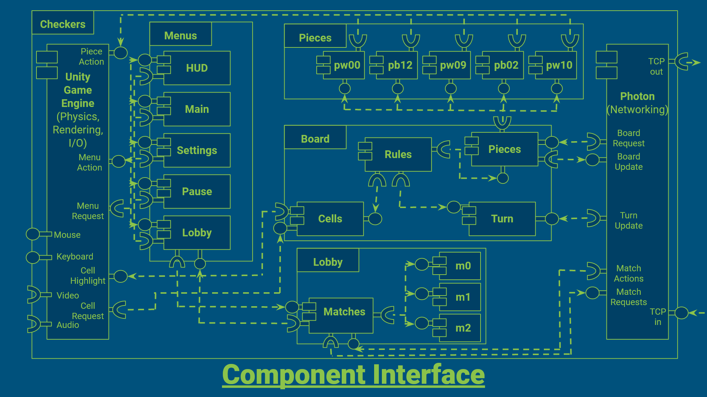

# 6.0 Interface

## 6.1 Diagram

## 6.2 *Unity*'s Architecture

- The *Unity* Game Engine makes heavy use of the *Component* design pattern
- It does so in support of an *Object Oriented Entity Component System*
- A game is composed of *Scenes*
- Each *Scene* has a collection of *GameObjects*
- Each *GameObject* is a *3D Primitive* with attached *Scripts* (called *MonoBehaviors*)
- All *MonoBehaviors* are extended from the base *MonoBehavior* and concern a set of *Lifetime Events* and *Lifetime Methods*
- These *Lifetime Methods* are a way of embedding side-effects within every *GameObject*, such as *2D Image Rendering*, *Physics Rendering* (position), and *Input/Output*
- These *GameObjects* differentiate between themselves by which *MonoBehaviors* they happen to have attached to themselves
- The *Scene* organized *GameObjects* under a tree of *Parent*-*Child* relationships
- Any *GameObject* can be *serialized* to a *Prefab*, similarly to the *Prototype* software pattern
- This allows multiple instances of the same *GameObject* to exist within a scene
- A Common organizational pattern in *Unity* is the use of *Empty GameObjects*, that have no *MonoBehaviors*, and simply hold other *GameObjects*
- *Photon*, our *Networking Solution*, also embeds itself within *GameObjects*

## 6.3 Representing *Unity*'s Architecture

- We can generally represent *GameObjects* in *Unity* as *Components*
- *Empty GameObjects* can be represented as *Projects* (holding *Components*)
- Since *Unity* handles *2D Image Rendering* (show piece positions), *Physics Rendering* (*move* the pieces to new positions), and *Input/Output Management* (mouse, keyboard), we  include it as a *Component* in the diagram, despite it actually being a capability embedded in every *GameObject*
- Likewise, *Networking* is shown as a separate *Component*, despite also being included in every *GameObject*
- Instead of focusing on all *Network*, *Physics*, and *Image Rendering* interactions, we show particular interactions, such as *Cell Highlighting*, *Piece Movement*, and *Cell Selection*

## 6.4 Major Concerns

### *Menus* (Project)
- each *Menu* has a very similar interface it shares with the *Unity Game Engine*
- each *Menu* adjusts a broad range of things, such as *Settings*, but otherwise has few strong dependencies with other *Components*
- These largely communicate with on-screen, flat (2D) images and the *Unity Game Engine* itself to adjust variables

### *Unity Game Engine* (Component)
- *Unity Game Engine* is largely a broad collection of side-effectful computation
- It handles *User Input*, *User Output*, *Menu Interaction*, and *Board Interaction*

### *Pieces* (Project)
- this is simply to demonstrate that the *Pieces* (Component) of the *Board* (Project) must be able to reference many *Piece-s* (Component-s) and set their *Physical Position* given their *Logical Position*

### *Board* (Project)
- This is the largest part of the project we are developing
- It encompasses the most responsibilities, and is shown as separate *Components* to illustrate this
- The *Rules* (Component) includes number of hops, hop distances, promotion, capturing, rule delegation
- The *Turn* (Component) simply tracks whose turn it is separate from the *Piece Positions*
- The *Cells* (Component) is how players interact with the board, and highlights particular cells, checks what pieces are in particular cells, and communicates those changes through the *Rules* (Component) to the *Pieces* (Component)
- as such, the majority of the *Relevant State* (Logical Piece Positions), carried across *Turns*, is contained to the *Pieces* (Component)
- The *Pieces* (Component) and *Turn* (Component) are therefore the only parts of the *Board* (Project) that needs to communicate with the *Photon* (Component) to issue and receive updates with the other *Player*

### *Lobby* (Project)
- This tracks what *Matches* other *Players* have created and allows *Unmatched Players* to join those *Players* who have opened a *Match* to play
- The *Matches* (Component) issues and receives updates using *Photon*

### *Photon* (Component)
- This enables the *Game* to work, by exchanging *Board State* in generic *TCP* Game Status Packets
- The *Messages* include *Board State* (positions, turns), *Match State* (username), and *Match Actions* (join, leave, create)

