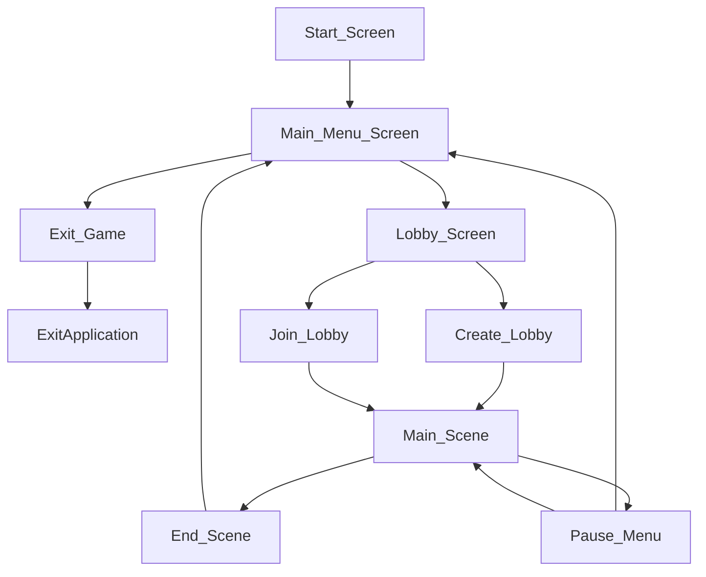

# 6. User Interface

<link href="checkers.css" rel="stylesheet"></link>

    

## 6.0 Note
For this section, `html` and `css` will be used to illustrate a Checkers board and the various hints and effects anticipated on that board.

HUD elements are drawn using bitmap graphics.

    

## 6.1 Elements

The following are recognized as part of the user interface:
- The **6.2 Checkers Board**
- The **6.3 Checkers Pieces**
- The **6.4 Heads-Up Display**
- The **6.5 Main Menu**
- The **6.6 Pause Menu**
- The **6.7 Settings Menu**
- The **6.8 Lobby Menu**

Elements will reference diagrams from the  **6.9 Diagrams** section.

    

## 6.2 Checkers Board

    

## 6.3 Checkers Pieces
These are the individual tokens that move around on the **Checkers Board**.

They can be:
- **Hovered-Over**
- **Selected**
- **Hinted**
- **Threatened**
- **Moved**

State-changes are communicated through highlighting the **Checkers Pieces** and **Cells** on the **Checkers Board** with different **Colors**.

    

## 6.4 Flow Chart

## 6.5 Heads-Up Display
These are on-screen flat, 2D elements that overlay any other elements. In a 3D game, these are often ammo counters, health meters, and timers.

In *Supreme Checkers*, these are:
- The **Turn Controls**
- The **Game Clock**

    

## 6.6 Main Menu
The main menu lists 

    

## 6.7 Pause Menu

    

## 6.8 Settings Menu

    

## 6.9 Lobby Menu

    

## 6.10 Diagrams

  

### 6.10.1 Blank Checkers Board

    

        <table class="board" cellpadding="0" cellspacing="0">
            <tr>
                <td >
8
</td>
                <td></td>
                <td></td>
                <td></td>
                <td></td>
                <td></td>
                <td></td>
                <td></td>
                <td></td>
            </tr>
            <tr>
                <td>
7
</td>
                <td></td>
                <td></td>
                <td></td>
                <td></td>
                <td></td>
                <td></td>
                <td></td>
                <td></td>
            </tr>
            <tr>
                <td>
6
</td>
                <td></td>
                <td></td>
                <td></td>
                <td></td>
                <td></td>
                <td></td>
                <td></td>
                <td></td>
            </tr>
            <tr>
                <td>
5
</td>
                <td></td>
                <td></td>
                <td></td>
                <td></td>
                <td></td>
                <td></td>
                <td></td>
                <td></td>
            </tr>
            <tr>
                <td>
4
</td>
                <td></td>
                <td></td>
                <td></td>
                <td></td>
                <td></td>
                <td></td>
                <td></td>
                <td></td>
            </tr>
            <tr>
                <td>
3
</td>
                <td></td>
                <td></td>
                <td></td>
                <td></td>
                <td></td>
                <td></td>
                <td></td>
                <td></td>
            </tr>
            <tr>
                <td>
2
</td>
                <td></td>
                <td></td>
                <td></td>
                <td></td>
                <td></td>
                <td></td>
                <td></td>
                <td></td>
            </tr>
            <tr>
                <td>
1
</td>
                <td></td>
                <td></td>
                <td></td>
                <td></td>
                <td></td>
                <td></td>
                <td></td>
                <td></td>
            </tr>
            <tr>
                <td></td>
                <td>
A
</td>
                <td>
B
</td>
                <td>
C
</td>
                <td>
D
</td>
                <td>
E
</td>
                <td>
F
</td>
                <td>
G
</td>
                <td>
H
</td>
            </tr>
        </table>
    

  

### 6.10.2 Initial Setup Positions

    

        <table class="board" cellpadding="0" cellspacing="0">
            <tr>
                <td >
8
</td>
                <td></td>
                <td>
&#9922;
</td>
                <td></td>
                <td>
&#9922;
</td>
                <td></td>
                <td>
&#9922;
</td>
                <td></td>
                <td>
&#9922;
</td>
            </tr>
            <tr>
                <td>
7
</td>
                <td>
&#9922;
</td>
                <td></td>
                <td>
&#9922;
</td>
                <td></td>
                <td>

&#9922;
</td>
                <td></td>
                <td>

&#9922;
</td>
                <td></td>
            </tr>
            <tr>
                <td>
6
</td>
                <td></td>
                <td>
&#9922;
</td>
                <td></td>
                <td>
&#9922;
</td>
                <td></td>
                <td>
&#9922;
</td>
                <td></td>
                <td>
&#9922;
</td>
            </tr>
            <tr>
                <td>
5
</td>
                <td></td>
                <td></td>
                <td></td>
                <td></td>
                <td></td>
                <td></td>
                <td></td>
                <td></td>
            </tr>
            <tr>
                <td>
4
</td>
                <td></td>
                <td></td>
                <td></td>
                <td></td>
                <td></td>
                <td></td>
                <td></td>
                <td></td>
            </tr>
            <tr>
                <td>
3
</td>
                <td>
&#9922;
</td>
                <td></td>
                <td>
&#9922;
</td>
                <td></td>
                <td>
&#9922;
</td>
                <td></td>
                <td>
&#9922;
</td>
                <td></td>
            </tr>
            <tr>
                <td>
2
</td>
                <td></td>
                <td>
&#9922;
</td>
                <td></td>
                <td>
&#9922;
</td>
                <td></td>
                <td>
&#9922;
</td>
                <td></td>
                <td>
&#9922;
</td>
            </tr>
            <tr>
                <td>
1
</td>
                <td>
&#9922;
</td>
                <td></td>
                <td>
&#9922;
</td>
                <td></td>
                <td>
&#9922;
</td>
                <td></td>
                <td>
&#9922;
</td>
                <td></td>
            </tr>
            <tr>
                <td></td>
                <td>
A
</td>
                <td>
B
</td>
                <td>
C
</td>
                <td>
D
</td>
                <td>
E
</td>
                <td>
F
</td>
                <td>
G
</td>
                <td>
H
</td>
            </tr>
        </table>
    

  

### 6.10.3 Example Highlights

    

        <table class="board" cellpadding="0" cellspacing="0">
            <tr>
                <td >
8
</td>
                <td></td>
                <td>
&#9922;
</td>
                <td></td>
                <td class="selected">
&#9922;
</td>
                <td></td>
                <td>
&#9922;
</td>
                <td></td>
                <td>
&#9922;
</td>
            </tr>
            <tr>
                <td>
7
</td>
                <td>
&#9922;
</td>
                <td></td>
                <td>
&#9922;
</td>
                <td></td>
                <td class="threatened">

&#9922;
</td>
                <td></td>
                <td>

&#9922;
</td>
                <td></td>
            </tr>
            <tr>
                <td>
6
</td>
                <td></td>
                <td>
&#9922;
</td>
                <td></td>
                <td>
&#9922;
</td>
                <td></td>
                <td>
&#9922;
</td>
                <td></td>
                <td>
&#9922;
</td>
            </tr>
            <tr>
                <td>
5
</td>
                <td class="hovered"></td>
                <td></td>
                <td></td>
                <td></td>
                <td></td>
                <td></td>
                <td></td>
                <td></td>
            </tr>
            <tr>
                <td>
4
</td>
                <td></td>
                <td class="selected"></td>
                <td></td>
                <td></td>
                <td class="threatened"></td>
                <td></td>
                <td></td>
                <td></td>
            </tr>
            <tr>
                <td>
3
</td>
                <td>
&#9922;
</td>
                <td></td>
                <td>
&#9922;
</td>
                <td></td>
                <td>
&#9922;
</td>
                <td></td>
                <td>
&#9922;
</td>
                <td></td>
            </tr>
            <tr>
                <td>
2
</td>
                <td></td>
                <td>
&#9922;
</td>
                <td></td>
                <td>
&#9922;
</td>
                <td></td>
                <td>
&#9922;
</td>
                <td></td>
                <td>
&#9922;
</td>
            </tr>
            <tr>
                <td>
1
</td>
                <td>
&#9922;
</td>
                <td></td>
                <td>
&#9922;
</td>
                <td></td>
                <td>
&#9922;
</td>
                <td></td>
                <td>
&#9922;
</td>
                <td></td>
            </tr>
            <tr>
                <td></td>
                <td>
A
</td>
                <td>
B
</td>
                <td>
C
</td>
                <td>
D
</td>
                <td>
E
</td>
                <td>
F
</td>
                <td>
G
</td>
                <td>
H
</td>
            </tr>
        </table>
    

  

### 6.10.4 Hovering Over a Piece

  

### 6.10.5 Selecting a Piece

