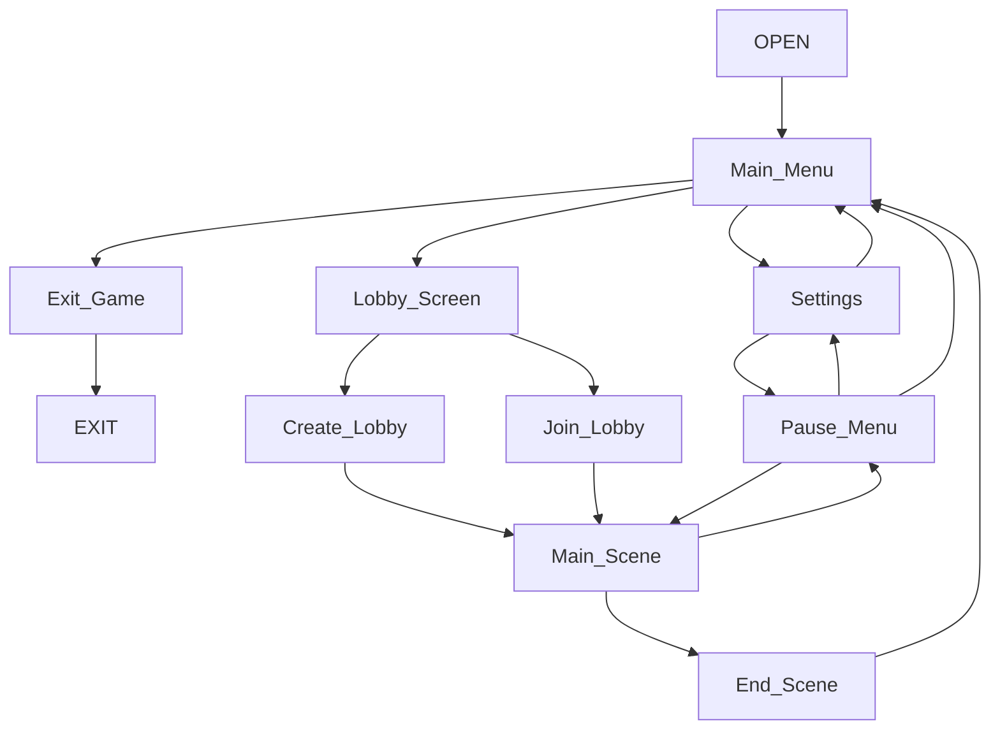
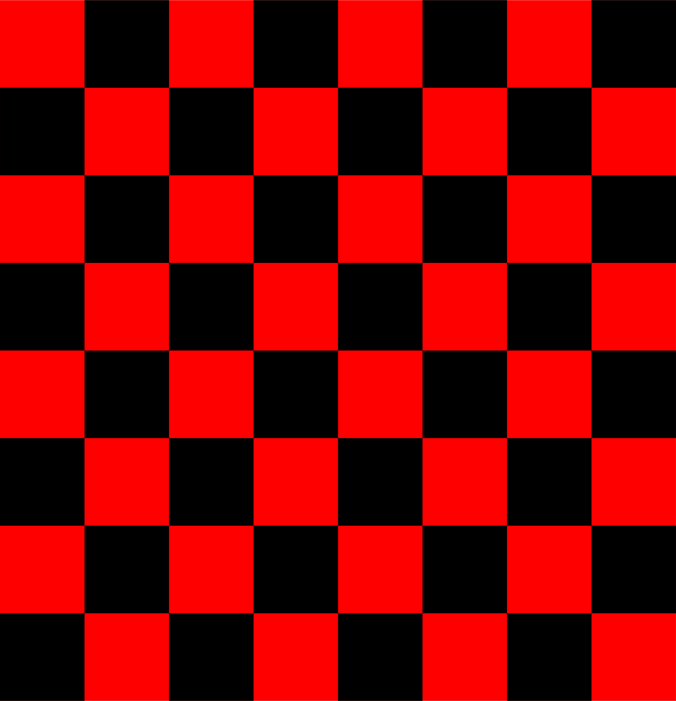
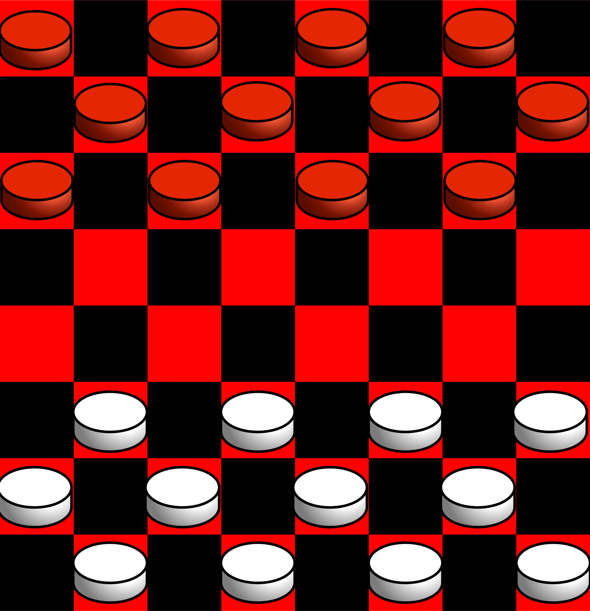
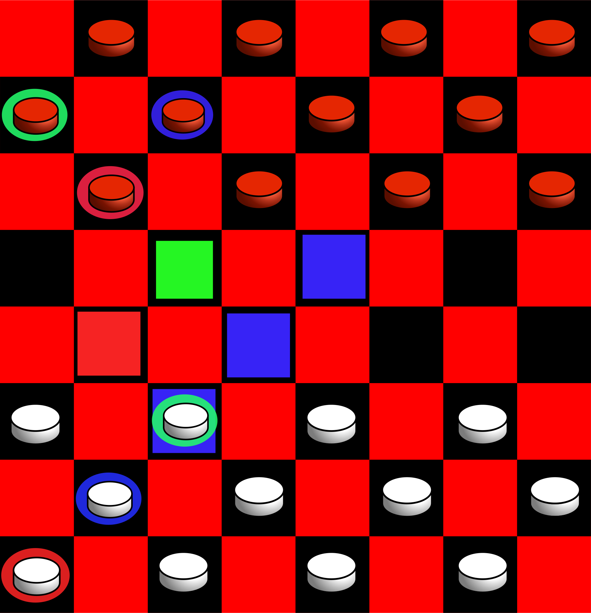
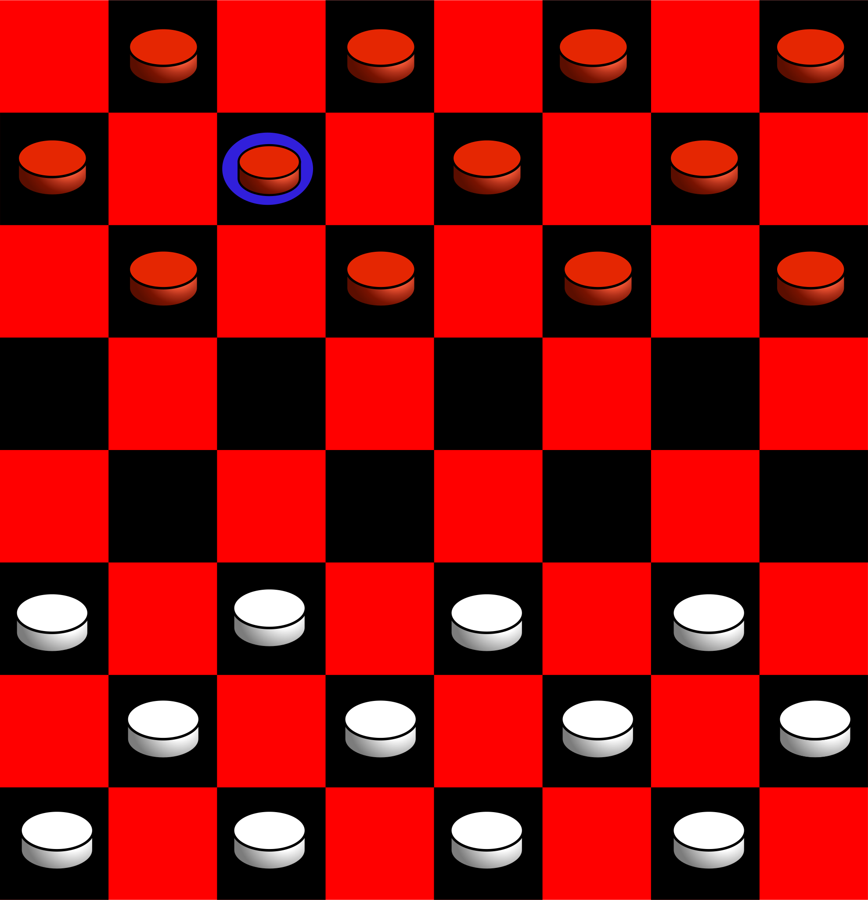
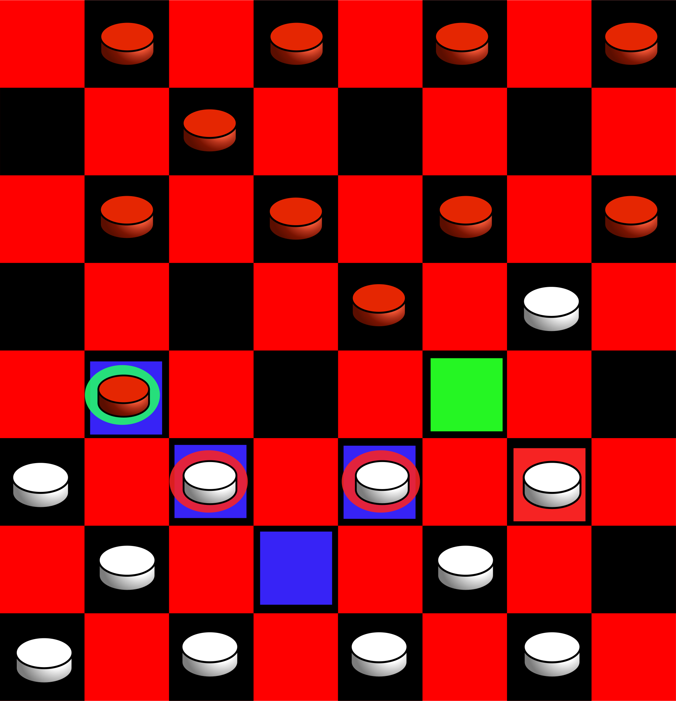
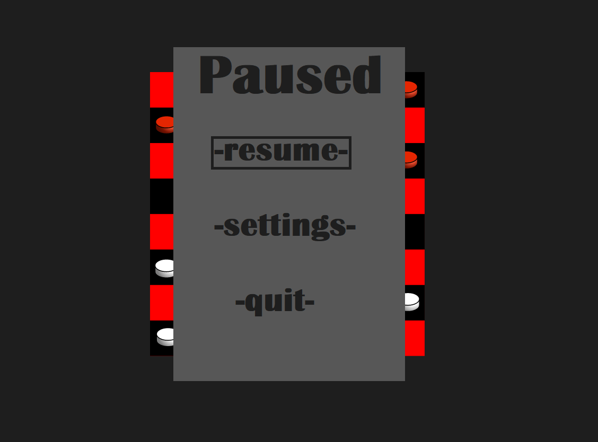
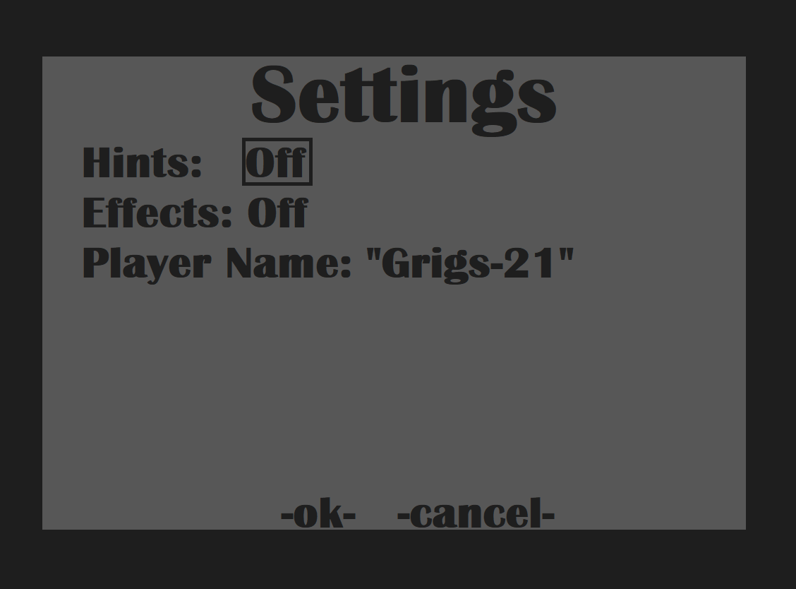
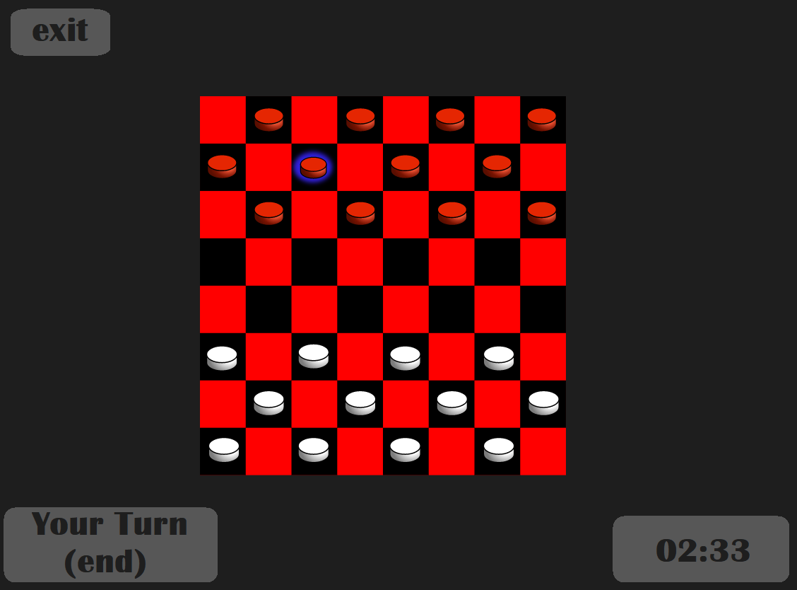

# 6. User Interface

    

## 6.0 Note

For this section, `svg` graphics will be used to illustrate a Checkers board and the various hints and effects anticipated on that board.

HUD and menu elements are drawn using bitmap graphics.

We refer to the User as Player (given game terminology), and Indicate Major Concepts or References in Capitals. We refer to the Application as Game.

Pieces and Tiles can provide colors as hints, mostly to show if they are Selected or Available. The following is used for hints:

- **Available:** *Blue*, such as on-mouse-hover, or selecting a path
- **Selected:** *Green*, such as on-mouse-click, or end of path
- **Threatened:** *Red*, such as attacked pieces, or attacking squares

See [6.11.3 Example Highlights](#6.11.3-example-highlights) for some of these.

    

## 6.1 Elements

The following are recognized as part of the user interface:
- The **6.2 Checkers Board**
- The **6.3 Checkers Pieces**
- The **6.4 Menu Flow**
- The **6.5 Heads-Up Display**
- The **6.6 Main Menu**
- The **6.7 Pause Menu**
- The **6.8 Settings Menu**
- The **6.9 Lobby Menu**

Elements will reference diagrams from the  **6.9 Diagrams** section.

**`R6.1.0`** There is a Board **Priority 1**

**`R6.1.1`** There is a complete set of Red and White Pieces **Priority 1**

**`R6.1.2`** There is a Menu Flow **Priority 1**

**`R6.1.3`** There is a Heads-Up Display **Priority 3**

**`R6.1.4`** There is a Main Menu **Priority 1**

**`R6.1.5`** There is a Pause Menu **Priority 3**

**`R6.1.6`** There is a Settings Menu **Priority 3**

**`R6.1.7`** There is a Lobby Menu **Priority 1**

    

## 6.2 Checkers Board

The Board is rendered to the screen as an alternating sequence of red and black squares called Tiles. See [6.11.1 Blank Checkers Board](#6.11.1-blank-checkers-board).

Each Tile can give the Player a Hint, similarly to the Pieces.

Pieces occupy Tiles, and indicate such by rendering over them. It is very important that the logical position ("A-2") corresponds to the on-screen position ("256 x 122") when it is rendered.

**`R6.2.0`** Empty Tiles do not render any elements within them **Priority 1**

**`R6.2.1`** Pieces render above correct tiles **Priority 1**

**`R6.2.2`** Tiles hint at being Part of Path **Priority 2**

**`R6.2.3`** Tiles hint at being End of Path **Priority 2**

**`R6.2.4`** Tiles hint at being threatened **Priority 3**

**`R6.2.5`** Board is 8 Tiles by 8 Tiles **Priority 1**

**`R6.2.6`** Board is rendered across most of screen **Priority 1**

**`R6.2.7`** No important part of Board is rendered Off-Screen **Priority 1**

**`R6.2.8`** Inactive Tiles do not hint at anything **Priority 2**

    

## 6.3 Checkers Pieces

These are the individual tokens that move around on the Board. They are Men and Kings, with particular movement rules covered elsewhere.

They can be:
- **(None):** No special statuses or effects
- **Hovered-Over:** Inspect their Availability
- **Selected:** By clicking on it
- **Threatened:** By a piece when drawing move path
- **Moved:** To a new location on the Board
- **Removed:** Stop rendering
- **Hinted:** The *Red*, *Green*, and *Blue* colors

See [6.11.4 Hovering Over a Piece](#6.11.4-hovering-over-a-piece) for an example interaction with a piece

**`R6.3.0`** Pieces render to the Board **Priority 1**

**`R6.3.1`** Pieces render to Logical Positions **Priority 1**

**`R6.3.2`** Man Pieces distinct from King Pieces **Priority 1**

**`R6.3.3`** Pieces hint at being Selectable **Priority 2**

**`R6.3.4`** Pieces hint at being Selected **Priority 2**

**`R6.3.5`** Pieces hint at being Threatened **Priority 3**

**`R6.3.6`** White Pieces are distinct from Red Pieces **Priority 1**

**`R6.3.7`** Piece positions render to correct location after Moving **Priority 1**

**`R6.3.8`** Piece positions render to correct location during Game Start **Priority 1**

    

## 6.4 Menu Flow

This is how the Player is anticipated to flow between each menu.

See [6.11.0 Menu Flow](#6.11.0-menu-flow).

**`R6.4.0`** Player can open Main Menu on Game Start **Priority 1**

**`R6.4.1`** Player can Exit Game from Main Menu **Priority 2**

**`R6.4.2`** Exit Game closes the Game **Priority 2**

**`R6.4.3`** Player can open Settings Menu from Main Menu **Priority 2**

**`R6.4.4`** Player can Return To Last Menu from Settings Menu **Priority 1**

**`R6.4.5`** Player can open Lobby Menu from Main Menu **Priority 1**

**`R6.4.6`** Player can Create Game from Lobby Menu **Priority 1**

**`R6.4.7`** Player can Join Game from Lobby Menu **Priority 1**

**`R6.4.8`** Player can load Main Scene from Creating Game **Priority 1**

**`R6.4.9`** Player can load Main Scene from Joining Game **Priority 1**

**`R6.4.10`** Player can End Game from Main Scene **Priority 2**

**`R6.4.11`** Player can open Pause Menu from Main Scene **Priority 3**

**`R6.4.12`** Player can open Settings Menu from Pause Menu **Priority 3**

**`R6.4.13`** Player can return to Pause Menu from Settings Menu **Priority 3**

**`R6.4.14`** Player can return to Main Scene from Pause Menu **Priority 1**

**`R6.4.15`** Player can return to Main Menu from Pause Menu **Priority 3**

**`R6.4.16`** Player can return to Main Menu from End Game **Priority 3**

    

## 6.5 Heads-Up Display

These are on-screen, flat, 2D elements that overlay any other elements. In a 3D game, these are often ammo counters, health meters, and timers.

In *Supreme Checkers*, these are:
- The **Turn Controls**
- The **Game Clock**
- Any **Accessibility Features** (such as an escape-key alternative)

See [6.11.8 Heads Up Display](#6.11.8-heads-up-display) for an example.

**`R6.5.0`** HUD is updated in real-time **Priority 1**

**`R6.5.1`** HUD responds to Player mouse-clicks **Priority 1**

**`R6.5.2`** An "ESC" HUD element exists for mouse-only Players **Priority 3**

**`R6.5.3`** "ESC" opens the Pause Menu **Priority 1**

**`R6.5.4`** An "End Turn" HUD element exists **Priority 3**

**`R6.5.5`** "End Turn" ends the Player's Turn **Priority 1**

    

## 6.6 Main Menu

The Main Menu lets the Player know the Game launched successfully.

It connects to the Lobby Menu.

**`R6.6.0`** Launching App opens the Main Menu **Priority 1**

**`R6.6.1`** Main Menu has "Exit" Button **Priority 1**

**`R6.6.2`** Main Menu has "Create Game" Button **Priority 1**

**`R6.6.3`** Main Menu has "Join Game" Button **Priority 1**

**`R6.6.4`** "Create Game" launches the Lobby Menu with Creation **Priority 1**

**`R6.6.5`** "Join Game" launches the Lobby Menu with Joining **Priority 1**

**`R6.6.6`** "Exit" closes the Game **Priority 2**

    

## 6.7 Pause Menu

The Pause Menu lets Players  

    

## 6.8 Settings

Main Menu Screen will have 3 Buttons: Exit Game, Settings, Play

**`R6.1`** Exit Game will terminate the Game. **Priority 1**

**`R6.2`** Settings will Open up a menu screen for the game settings. **Priority 2**

**`R6.3`** Play will open up the Lobby Screen. **Priority 1**

    

## 6.9 Lobby Menus
### 6.9.1 Create Menu
The Create Menu will show a list of the currently joined participants and will have a button to start the match once full.

**`R8.1`** The Start button will transition the clients into the Main Scene **Priority 1**

**`R8.2`** The list of participants will update when a Player joins lobby **Priority 1**

### 6.9.2 Join Menu
The Join menu will show a list of the currently open rooms that have not yet started and will make a button for joining each room.

**`R9.1`** The buttons for each room will put the Player into that lobby and update the host's game to show the status. **Priority 1**

## 6.10 Main Scene

    

## 6.11 Diagrams

  

### 6.11.0 Menu Flow

  

### 6.11.1 Blank Checkers Board

  

### 6.11.2 Initial Setup Positions

  

### 6.11.3 Example Highlights

  

### 6.11.4 Hovering Over a Piece

  

### 6.11.5 Selecting a Piece and Path

  

### 6.11.6 Pause Menu

  

### 6.11.7 Settings Menu

  

### 6.11.8 Heads Up Display

