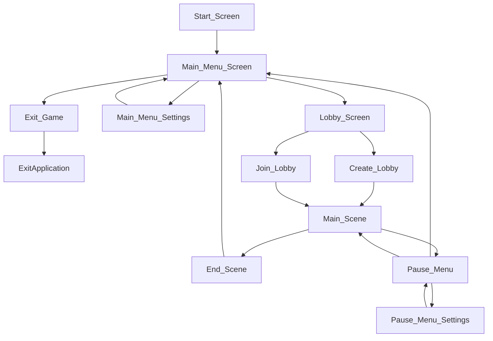

# 6. User Interface

<link href="checkers.css" rel="stylesheet"></link>

    

## 6.0 Note
For this section, `html` and `css` will be used to illustrate a Checkers board and the various hints and effects anticipated on that board.

HUD elements are drawn using bitmap graphics.

    

## 6.1 Elements

The following are recognized as part of the user interface:
- The **6.2 Checkers Board**
- The **6.3 Checkers Pieces**
- The **6.4 Menu Flow**
- The **6.5 Heads-Up Display**
- The **6.6 Main Menu**
- The **6.7 Pause Menu**
- The **6.8 Settings Menu**
- The **6.9 Lobby Menu**

Elements will reference diagrams from the  **6.9 Diagrams** section.

    

## 6.2 Checkers Board

    

## 6.3 Checkers Pieces
These are the individual tokens that move around on the **Checkers Board**.

They can be:
- **Hovered-Over**
- **Selected**
- **Hinted**
- **Threatened**
- **Moved**

State-changes are communicated through highlighting the **Checkers Pieces** and **Cells** on the **Checkers Board** with different **Colors**.

    

## 6.4 Menu Flow

This is how the user is anticipated to flow between each menu.

## 6.5 Heads-Up Display
These are on-screen flat, 2D elements that overlay any other elements. In a 3D game, these are often ammo counters, health meters, and timers.

In *Supreme Checkers*, these are:
- The **Turn Controls**
- The **Game Clock**

    

## 6.6 Main Menu
The main menu lists 

    

## 6.7 Pause Menu

    

## 6.8 Settings
### 6.8.1 Main Menu Settings

### 6.8.2 Pause Menu Settings

    

## 6.9 Lobby Menus
### 6.9.1 Create Menu

### 6.9.2 Join Menu

## 6.10 Main Scene

    

## 6.11 Diagrams

  

### 6.11.1 Blank Checkers Board

  

### 6.11.2 Initial Setup Positions

  

### 6.11.3 Example Highlights

  

### 6.11.4 Hovering Over a Piece

  

### 6.11.5 Selecting a Piece

