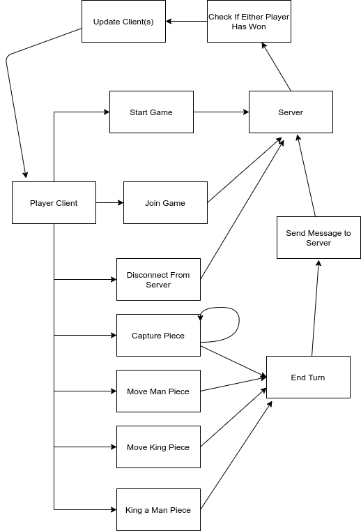

# 6. Use Cases

## 6.1 Use Case Flow

6.1.1 Starting Game 
* **Precondition**: The player is on the title screen.
* **Action**: The player clicks "New Game".
* **Postcondition**: A server will be created, and the player will be moved into a server automatically.
  The IP of the server will be displayed on the side.
  A maximum of one other player will be able to join the game using this server IP. 

6.1.2 Joining Game (Client)
* **Precondition**: The player is on the title screen.
* **Action**: The player clicks "Join Game" and inputs a valid IP address.
* **Postcondition**: The player will join the server and the game will automatically start.

6.1.3 Ending A Checkers Game
* **Precondition**: A game must be in-progress.
* **Action**: Either of the two players exits or disconnects from the game, or one of the players has captured the other
  player's final piece.
* **Postcondition**: The game will end, and both players will return to the title screen after 30
  seconds or after the player clicks the "Exit" button, whichever comes first.

6.1.4 Exiting the Game Application
* **Precondition**: The player is on the title screen.
* **Action**: The player clicks on "Exit".
* **Postcondition**: The game application closes.

6.1.5 Capturing Pieces
* **Precondition**: It is the player's turn to move, and the player can make a valid move to capture
  one or more pieces using either a Man or King piece.
* **Action**: A player can click on the checkers piece, and click on a empty diagonal square,
  crossing over an opponent's piece, as long as it is a valid move. If the player is able to repeat
  this process and capture a second piece with that same checkers piece, the player may do so. 
  If the player does not wish to do so, they can click on the "End Turn" button to end the turn. 
* **Postcondition**: The server registers the player's move and updates the other player's board to
  reflect the current board state.

6.1.6 Moving a Man Piece Without Capturing
* **Precondition**: The player has selected a Man piece.
* **Action**: The player selects an empty forward diagonal square.
* **Precondition**: The Man piece moves to the assigned square and the board state is updated.

6.1.7 Moving a King Piece Without Capturing
* **Precondition**: The player has selected a King piece
* **Action**: The player selects an empty forward or backwards diagonal square.
* **Precondition**: The King piece moves to the assigned square and the board state is updated.

6.1.8 Ending Your Turn
* **Precondition**: The player has made a valid move. A player may not pass their turn without
  making a valid move.
* **Action**: The player clicks on the "End turn" button.
* **Postcondition**: The server registers the move that the player made, and updates the other
  player's board to reflect the current board state.

6.1.9 Winning The Game
* **Precondition**: The other player has left or disconnected from the game, or the other player has
  no remaining pieces, or the other player has no valid moves.
* **Action**: The player wins the game.
* **Postcondition**: The player will automatically return to the title screen after 30 seconds, or
  after they click on the "Exit" button, whichever comes first.

6.1.10 Turning a Man Piece into a King Piece
* **Precondition**: A player's Man piece has moved to the opponent's closest row relative to
  the opponent's view of the board.
* **Action**: The Man piece turns into a King piece
* **Postcondition**: The newly promoted King piece will now be able to move diagonally backwards.

## 6.2 Activity Diagram

